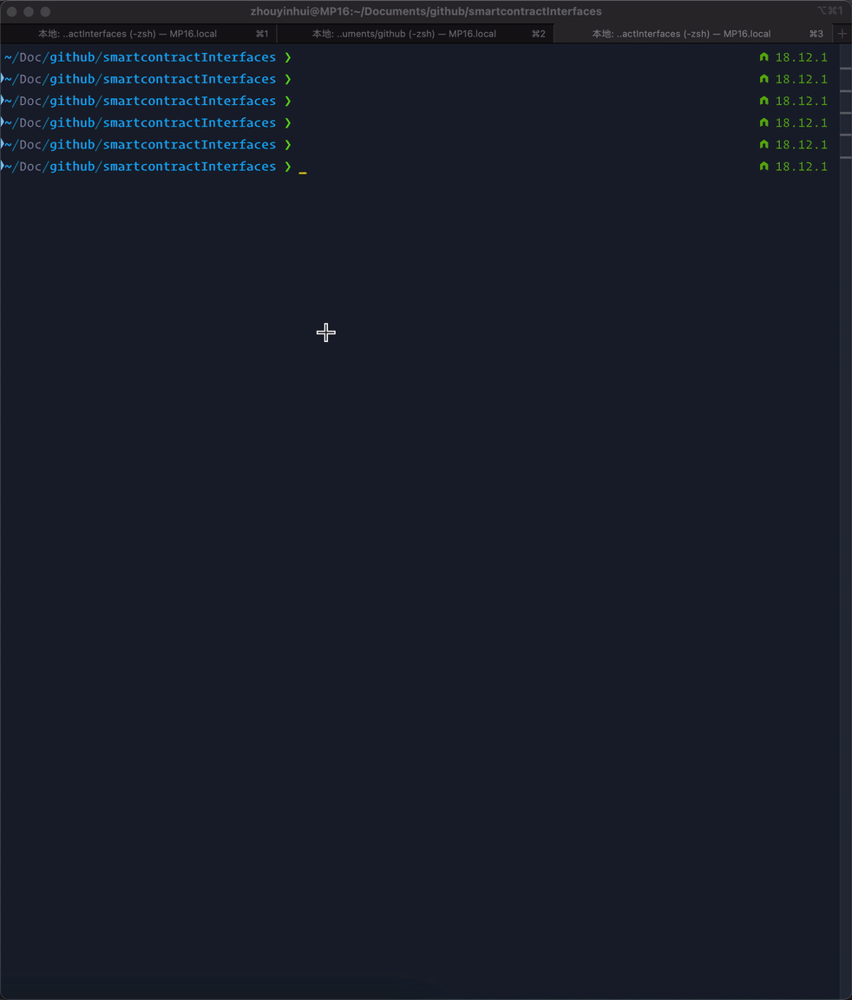

# 常用智能合约接口查询

小工具: 输入关键字查询智能合约接口

## 使用

`go run . <keyword>` 或 使用 `go build` 编译成二进制运行

关键字为接口名称或名称的一部分, 不区分大小写

查询完成后, 内容会自动复制到剪贴板

## 接口数据

接口数据在 `interface.sol` 中, 可自行添加 (interface 关键字和接口名称要在同一行)

也可以直接删掉该文件, 程序会从 "https://raw.githubusercontent.com/SunWeb3Sec/DeFiHackLabs/main/src/test/interface.sol" 下载
